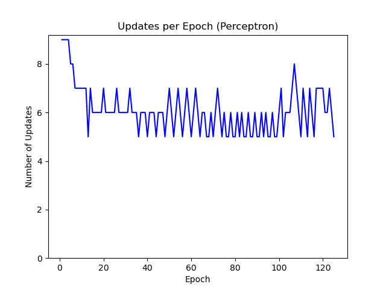
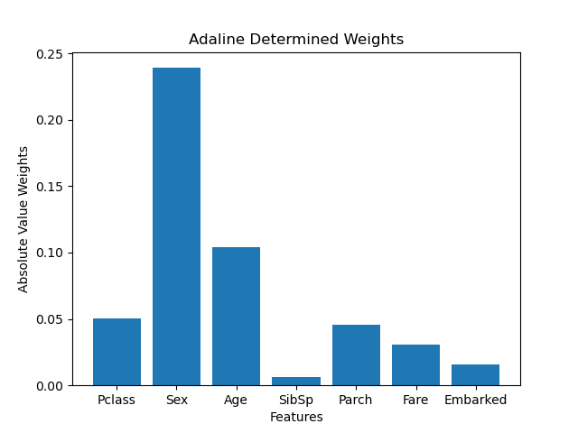

# Perceptrons

### Create synthetic dataset

Use the `create_linearly_sep_dataset.py` script to create 
a synthetic dataset. By default, a linearly separated dataset 
containing two groups will be output to a `dataset.txt` file.
Values of the two groups consist of integers between 1 and 100.
For linearly separated datasets, a random threshold is created
and the values (x1) for the first group will be 1 <= x1 < threshold.
The values (x2) for the second group wil be threshold <= x2 <= 100.
For non-linearly separated datasets, the values of both groups will 
be an integer between 1 and 100 inclusively. To ensure that the two 
groups are non-linearly separated, at least one of the random integers 
is inserted into both groups. The group assignments and values are
output to a tab-delimited file. A plot of the first two dimensions
is saved if the number of dimensions is greater than one.

Parameters:

- `-s` or `--size`: set sample size of dataset'

- `-o` or `--output`: set output file name

- `-l` or `--linearly_sep`: boolean to describe if dataset is 
linearly separable.

- `-f` or `--features`: set number of features

Example creating a two dimensional linearly separable dataset:
```
python create_linearly_sep_dataset.py -s 10 -o linear_sep_dataset.txt -f 2
```

Plot linearly separable dataset:


Example creating a two dimensional non-linearly separable dataset:
```
python create_linearly_sep_dataset.py -s 10 -o non_linear_sep_dataset.txt -f 2 -l F
```

Plot non-linearly separable dataset:


### Implement Perceptron

A perceptron was implemented in `perceptrons.py`. Weights are originally set as 
random values between 0 and 1. To predict values, the dot product of weights and 
values are calculated then rounded to the nearest class (0 if less than 0.5, else 1). 
The fit function updates the weights over a set number of iterations. The weights 
are updated using the perceptron learning rule: 
`dw = learning rate * (actual - predicted) * xi`. Additionally, a plot_results 
function was implemented to plot the number of errors at each epoch. 

```python
class Perceptron:
    """Perceptron implementation"""

    def __init__(self, rate=0.01, n=50, random_state=1, reduction=None):
        self.rate = rate  # learning rate
        self.n = n  # number of iterations
        self.random_state = random_state  #set random state
        self.reduction = reduction  # optional if dynamic learning rate is desired

    def fit(self, X, y):
        """Fit training data"""
        rand = np.random.RandomState(self.random_state)
        # initialize random weights
        self.w = rand.uniform(low=0.0, high=1, size=1+X.shape[1])
        # initialize array to hold # errors at each epoch
        self.err = []
        # loop through epochs
        for i in range(self.n):
            # initialize variable to keep track of errors
            errors = 0
            # if a rate reduction function is given
            if self.reduction is not None:
                # get updated rate
                self.rate = self.reduction.get()
            # loop through features and targets in X and y
            for xi, y_true in zip(X, y):
                # calulate update using perceptron learning rule
                u = self.rate * (y_true - self.predict(xi))
                # update weights
                self.w[1:] += (u * xi)
                self.w[0] += u
                # add to errors if update is not 0
                errors += int(u != 0.0)
            # append total number of errors in epoch to err
            self.err.append(errors)
        return self

    def calculate_dot(self, X):
        """Calculates dot product of values and weights wTx"""
        return np.dot(X, self.w[1:]) + self.w[0]

    def predict(self, X):
        """Predict results based on the output of the dot product"""
        # return 1 if dot product is greater or equal to 0.5, else 0
        return np.where(self.calculate_dot(X) >= 0.5, 1, 0)

    def plot_results(self):
        """Returns a plot of error vs epoch"""
        # close any open plt
        plt.close()
        # plot epoch as x and num errors as y
        plt.plot([i + 1 for i in range(len(self.err))], self.err, 'b')
        plt.xlabel("Epoch")
        plt.ylabel("Number of Updates")
        plt.ylim(bottom=0)
        return plt
```

Additionally, the perceptron in Python Machine Learning (PML) Ch. 2 
was tested. The textbook implementation was modified slightly. The 
textbook implementation used data with -1 or 1 classes, so the 
rounding in the predict class was changed for 0 or 1 
classes. A plot_results function was added to facilitate data reporting.
One difference between the implementation above and the textbook
implementation is that the implementation above sets the initial
weights to random values, where the random numbers are taken from 
a normal distribution with a standard deviation of 0.01. 

```python
class PerceptronPML(object):
    """Perceptron classifier.

    Parameters
    ------------
    eta : float
      Learning rate (between 0.0 and 1.0)
    n_iter : int
      Passes over the training dataset.
    random_state : int
      Random number generator seed for random weight
      initialization.

    Attributes
    -----------
    w_ : 1d-array
      Weights after fitting.
    errors_ : list
      Number of misclassifications (updates) in each epoch.

    """

    def __init__(self, eta=0.01, n_iter=50, random_state=1):
        self.eta = eta
        self.n_iter = n_iter
        self.random_state = random_state

    def fit(self, X, y):
        """Fit training data.

        Parameters
        ----------
        X : {array-like}, shape = [n_samples, n_features]
          Training vectors, where n_samples is the number of
          samples and
          n_features is the number of features.
        y : array-like, shape = [n_samples]
          Target values.

        Returns
        -------
        self : object

        """
        rgen = np.random.RandomState(self.random_state)
        self.w_ = rgen.normal(loc=0.0, scale=0.01,
                              size=1 + X.shape[1])
        self.errors_ = []

        for _ in range(self.n_iter):
            errors = 0
            for xi, target in zip(X, y):
                update = self.eta * (target - self.predict(xi))
                self.w_[1:] += update * xi
                self.w_[0] += update
                errors += int(update != 0.0)
            self.errors_.append(errors)
        return self

    def net_input(self, X):
        """Calculate net input"""
        return np.dot(X, self.w_[1:]) + self.w_[0]

    def predict(self, X):
        """Return class label after unit step"""
        return np.where(self.net_input(X) >= 0.5, 1, 0)  # changed for classes 1 and 0

    def plot_results(self):
        """Returns a plot of error vs epoch"""
        plt.close()
        plt.plot([i + 1 for i in range(len(self.errors_))], self.errors_, 'b')
        plt.xlabel("Epoch")
        plt.ylabel("Number of Updates")
        plt.ylim(bottom=0)
        return plt
```

A heuristic model was also implemented to use for testing. The weights for the 
model are set randomly for predictions. 

```python
class Heuristic:
    """Heuristic classifier implementation"""
    def __init__(self, random_state=1):
        self.random_state = random_state  # set random state

    def fit(self, X, y):
        """Fit training data"""
        rand = np.random.RandomState(self.random_state)
        # initialize random weights
        self.w = rand.uniform(low=0.0, high=1, size=X.shape[1])
        return self

    def calculate_dot(self, X):
        """Calculates dot product of values and weights wTx"""
        return np.dot(X, self.w)

    def predict(self, X):
        """Predict results based on the output of the dot product"""
        # return 1 if dot product is greater or equal to 0.5, else 0
        return np.where(self.calculate_dot(X) >= 0.5, 1, 0)
```

To visualize the decision boundaries, a function was added to plot
the data with the model's decision boundary. This function is from 
PML Chapter 2.

```python
def plot_decision_regions(X, y, classifier, resolution=0.02):
    """Function from Ch.2 of Python Machine Learning ISBN: 9781787125933"""
    # setup marker generator and color map
    markers = ('s', 'x', 'o', '^', 'v')
    colors = ('red', 'blue', 'lightgreen', 'gray', 'cyan')
    cmap = ListedColormap(colors[:len(np.unique(y))])

    # plot the decision surface
    x1_min, x1_max = X[:, 0].min() - 1, X[:, 0].max() + 1
    x2_min, x2_max = X[:, 1].min() - 1, X[:, 1].max() + 1
    xx1, xx2 = np.meshgrid(np.arange(x1_min, x1_max, resolution),
                           np.arange(x2_min, x2_max, resolution))
    Z = classifier.predict(np.array([xx1.ravel(), xx2.ravel()]).T)
    Z = Z.reshape(xx1.shape)
    plt.contourf(xx1, xx2, Z, alpha=0.3, cmap=cmap)
    plt.xlim(xx1.min(), xx1.max())
    plt.ylim(xx2.min(), xx2.max())

    # plot class samples
    for idx, cl in enumerate(np.unique(y)):
        plt.scatter(x=X[y == cl, 0],
                    y=X[y == cl, 1],
                    alpha=0.8,
                    c=colors[idx],
                    marker=markers[idx],
                    label=cl,
                    edgecolor='black')
``` 

### Test perceptron on synthetic datasets

To test the implemented perceptrons, additional code was added
to the `perceptrons.py` script to run both models on a given 
dataset. The script will train and fit the data using each 
implementation and save a plot of updates vs epochs and the decision
boundary for each one.

```python
# read data using pandas
train_data = pd.read_csv(train_file, sep='\t')

# set target
y = train_data.group

# subset data for features
X = train_data.iloc[:, [1, 2]].values

# split data
X_train, X_val, y_train, y_val = train_test_split(X, y, random_state=1)

# set and train model (using learning rate 0.0001)
model = Perceptron(rate=0.0001, n=125)
model.fit(X_train, y_train)
plt1 = model.plot_results()
plt1.title('Updates per Epoch (Perceptron)')
plt1.savefig(str(output_file) + '_updates_per_epoch_perceptron' + '.png')

# plot decision boundary
plt.close()
plot_decision_regions(X_train, y_train, classifier=model)
plt.xlabel("value_1")
plt.ylabel("value_2")
plt.legend(loc='upper left')
plt.title("Decision Boundary (Perceptron)")
plt.savefig(str(output_file) + '_boundary_perceptron' + '.png')

# set and train model using PML implementation
model2 = PerceptronPML(eta=0.0001, n_iter=10)
model2.fit(X_train, y_train)
# plot errors vs epoch for PML implementation
plt2 = model2.plot_results()
plt2.title('Updates per Epoch (PML Perceptron)')
plt2.savefig(str(output_file) + '_updates_per_epoch_pml_perceptron' + '.png')

# plot decision boundary
plt.close()
plot_decision_regions(X_train, y_train, classifier=model2)
plt.xlabel("value_1")
plt.ylabel("value_2")
plt.legend(loc='upper left')
plt.title("Decision Boundary (PML Perceptron)")
plt.savefig(str(output_file) + '_boundary_pml_perceptron' + '.png')
```

The `perceptrons.py` script was run on both the linearly and non-linearly
separable datasets generated above. 

```
python perceptrons.py -t linear_sep_dataset.txt -o synthetic_results\linear_sep_data
python perceptrons.py -t non_linear_sep_dataset.txt -o synthetic_results\non_linear_sep_data
```

For the linearly separable dataset, both models converged (no more updates). 
The PML implementation converged much earlier than the Perceptron implementation as seen in the following plots. 


The determined decision boundaries are shown in the following plots:


Both models were not able to converge using the non-linearly separable dataset. 




The models did not determine correct decision boundaries for the non-linearly separable
datasets as shown in the following plots:


The heuristic model was unable to determine correct decision boundaries for both the
linearly separable and non-linearly separable datasets. 

Linearly separable dataset:


Non-linearly separable dataset:


### Train Adaline Model using Titanic Dataset

The dataset train.csv from https://www.kaggle.com/c/titanic was used to train an Adaline
model to predict the survival of passengers. All code for this is found in 
`adaline.py`. Minor modifications to the AdalineGD implementation 
from PML Ch 2 were made to work with the predicted values of 0 and 1 instead of -1 and 1. 

```python
class AdalineGD(object):
    """ADAptive LInear NEuron classifier.
    From from Ch.2 of Python Machine Learning ISBN: 9781787125933
    modified to accept labels of 0 or 1 instead of -1 or 1.

    Parameters
    ------------
    eta : float
      Learning rate (between 0.0 and 1.0)
    n_iter : int
      Passes over the training dataset.
    random_state : int
      Random number generator seed for random weight
      initialization.


    Attributes
    -----------
    w_ : 1d-array
      Weights after fitting.
    cost_ : list
      Sum-of-squares cost function value in each epoch.

    """
    def __init__(self, eta=0.01, n_iter=50, random_state=1):
        self.eta = eta
        self.n_iter = n_iter
        self.random_state = random_state

    def fit(self, X, y):
        """ Fit training data.

        Parameters
        ----------
        X : {array-like}, shape = [n_samples, n_features]
          Training vectors, where n_samples is the number of
          samples and
          n_features is the number of features.
        y : array-like, shape = [n_samples]
          Target values.

        Returns
        -------
        self : object

        """
        rgen = np.random.RandomState(self.random_state)
        self.w_ = rgen.normal(loc=0.0, scale=0.01,
                              size=1 + X.shape[1])
        self.cost_ = []

        for i in range(self.n_iter):
            net_input = self.net_input(X)
            output = self.activation(net_input)
            errors = (y - output)
            self.w_[1:] += self.eta * X.T.dot(errors)
            self.w_[0] += self.eta * errors.sum()
            cost = (errors**2).sum() / 2.0
            self.cost_.append(cost)
        return self

    def net_input(self, X):
        """Calculate net input"""
        return np.dot(X, self.w_[1:]) + self.w_[0]

    def activation(self, X):
        """Compute linear activation"""
        return X

    def predict(self, X):
        """Return class label after unit step"""
        return np.where(self.activation(self.net_input(X))
                        >= 0.5, 1, 0)  # modified for 0 and 1 data
```

Several Preprocessing steps were required before training the model. 
Any samples with na values were dropped from the dataset. The dataset was
subset by the features most likely to impact survival. These features 
 were 'Pclass', 'Sex', 'Age', 'SibSp', 'Parch', 'Fare', 'Embarked'. Then 
the dataset was split into 70% training data and 30% validation data using
test_train_split from sklearn. 

```python
from sklearn.model_selection import train_test_split

# read data using pandas
data = pd.read_csv(train_file)

# drop missing values
data = data.dropna(axis=0)

# set target
y = data.Survived

# select features
features = ['Pclass', 'Sex', 'Age', 'SibSp', 'Parch', 'Fare', 'Embarked']

# subset data
X = data[features]

# split data into 70% training 30% testing
X_train, X_val, y_train, y_val = train_test_split(X, y, random_state=1, train_size=0.7)
```

Any features that are not numerical needed to be encoded. Previous exploration
of this dataset identified label encoding as a good method of encoding [(1)](https://github.com/jmattick/titanic-machine-learning).
The LabelEncoder from sklearn was used to encode non-numerical features.

```python
from sklearn.preprocessing import LabelEncoder

def label_encoding(train_X, val_X, cols):
    """Function using label encoding to convert categorical columns
    to numbers"""
    # copy data
    label_train_X = train_X.copy()
    label_val_X = val_X.copy()

    # define label encoder
    label_encoder = LabelEncoder()

    # encode labels for each feature in list
    for col in cols:
        label_train_X[col] = label_encoder.fit_transform(train_X[col])
        label_val_X[col] = label_encoder.transform(val_X[col])

    return label_train_X, label_val_X

# get list of categorical variables
c = (X.dtypes == 'object')
# if categorical features exist extract index
if len(c > 0):
    features_to_encode = list(c[c].index)
    X_train, X_val = label_encoding(X_train, X_val, features_to_encode)
```

Features were scaled using the sklearn StandardScaler to center the data
at zero with a standard deviation of 1. This improves the performance of 
the gradient descent algorithm by reducing the steps needed to find an 
optimal solution. 

```python
from sklearn.preprocessing import StandardScaler

# scale data using sklearn StandardScaler
sc = StandardScaler()
# fit scaler on training data
sc.fit(X_train)
# transform training and validation data
X_train = sc.transform(X_train)
X_val = sc.transform(X_val)
``` 

To facilitate testing, a function was created to return the accuracy
of a model for a given dataset. The function will fit the model with the
training dataset and predict values from the validation dataset. 
The accuracy_score method from sklearn calculates the accuracy of the 
predictions from the validation dataset. 

```python
from sklearn.metrics import accuracy_score

def test_model(train_X, val_X, train_y, val_y, model):
    """Function to return the accuracy of a given model and dataset"""
    # Fit model
    model.fit(train_X, train_y)

    # get predicted values
    val_predict = model.predict(val_X)

    # return accuracy
    return accuracy_score(val_y, val_predict)
```

Several different learning rates were tested to identify an optimal rate.

```python
class ConstantReduction:
    """Reduces learning rate by dividing by a constant factor"""

    def __init__(self, start=0.01, factor=2):
        self.rate = start
        self.factor = factor

    def get(self):
        # update rate by dividing by factor
        r = self.rate
        self.rate = self.rate / self.factor
        return r

# test different learning rates
reducing_rate = ConstantReduction(start=0.001, factor=2)
rates = []
accuracies = []
for i in range(10):
    rate = reducing_rate.get()
    rates.append(rate)
    accuracy = test_model(X_train, X_val, y_train, y_val, model=AdalineGD(eta=rate))
    accuracies.append(accuracy)

# plot accuracy vs learning rate
plt.plot(rates, accuracies)
plt.xlabel("Learning Rate")
plt.ylabel("Accuracy")
plt.savefig(str(output_file) + "_learning_rate_tests.png")
plt.close()
``` 

The accuracy of prediction using the AdalineGD model peaked at a learning
rate of 0.005. 


Additionally the error at each epoch of the AdalineGD model was
used to determine the optimal rate. At a rate of 0.005 the error 
reduces at each epoch before leveling off. 


To determine the most predictive features of the AdalineGD titanic
model, the model was trained using all the features of interest with a learning
rate of 0.0005. The magnitude of the final weights of the model were plotted.

```python
# Run model using all features
model = AdalineGD(eta=0.0005)
model.fit(X_train, y_train)

# plot feature weights
abs_w = [abs(model.w_[i]) for i in range(1, len(model.w_))]
plt.bar(features, abs_w)
plt.xlabel("Features")
plt.ylabel("Absolute Value Weights")
plt.title("Adaline Determined Weights")
plt.savefig(str(output_file) + "_adaline_weights.png")
plt.close()
``` 

The features that had the greatest absolute weight was Sex, Age, 
and Class. These features likely have the largest impact on the 
prediction.



To confirm that these features had the largest impact on the predicted
values, the AdalineGD model was trained using each feature individually. 
The accuracies were compared to each other and the accuracy of using 
all of the features. 

```python
def test_features(X_train, X_val, y_train, y_val, feature_combinations, model):
    res = []
    for f in feature_combinations:
        sub_X_train = X_train[:, f]
        sub_X_val = X_val[:, f]
        res.append(test_model(sub_X_train, sub_X_val, y_train, y_val, model))
    return res

# get list to index features
features_index = [[i] for i in range(len(features))]
features_index.append([i for i in range(len(features))])

# test model using a single feature for each feature
res = test_features(X_train, X_val, y_train, y_val, features_index, model=AdalineGD(eta=0.0005))

# plot accuracy vs feature used
xlabels = features.copy()
xlabels.append("All")
plt.bar(xlabels, res)
plt.xlabel("Features")
plt.ylabel("Accuracy")
plt.title("Prediction Accuracy")
plt.savefig(str(output_file) + "_feature_accuracy.png")
plt.close()
```

The accuracy of predictions using sex as the only feature was heigher than 
the accuracy of using any other feature alone. The accuracy of using all of the features
to predict survival was still higher. The individual accuracies in combination with the 
weights shows that sex is the most predictive feature, but other features in combination
with sex such as age or class also improve predictions.  


Finally, the accuracy of predictions using the AdalineGD model on the titanic dataset were 
compared to the heuristic model. 

```python
# accuracy for adaline and heuristic
ad = test_model(X_train, X_val, y_train, y_val, model=AdalineGD(eta=0.0005))
heu = test_model(X_train, X_val, y_train, y_val, model=Heuristic())

# plot accuracy compared to Heuristic
plt.bar(["AdalineGD", "Heuristic"], [ad, heu])
plt.ylim(0, 1)
plt.xlabel("Model")
plt.ylabel("Accuracy")
plt.title("Model Performance")
plt.savefig(str(output_file) + '_performance.png')
plt.close()
```

Using the features 'Pclass', 'Sex', 'Age', 'SibSp', 'Parch', 'Fare',and 'Embarked' with a learning rate
of 0.0005, the accuracy of the AdalineGD model was 0.76. The accuracy of the 
heuristic that uses random weights was 0.32. 


# Usage

### Install Dependencies 

Install dependencies using provided environment file: 
```
conda env create -f environment.yml
```

### Create synthetic dataset

Use the `create_linearly_sep_dataset.py` script to create 
a synthetic dataset. 

Parameters:

- `-s` or `--size`: set sample size of dataset'

- `-o` or `--output`: set output file name

- `-l` or `--linearly_sep`: boolean to describe if dataset is 
linearly separable.

- `-f` or `--features`: set number of features

Example creating a two dimensional linearly separable dataset:

```
python create_linearly_sep_dataset.py -s 10 -o linear_sep_dataset.txt -f 2
```

Example creating a two dimensional non-linearly separable dataset:

```
python create_linearly_sep_dataset.py -s 10 -o non_linear_sep_dataset.txt -f 2 -l F
```

### Test Perceptron Implementation

Use `perceptrons.py` to run two implementations of a perceptron on a given
dataset.

Parameters:

- `-t` or `--train`: input training dataset

- `-o` or `--output`: set output file base name

Example:

```
python perceptrons.py -t linear_sep_dataset.txt -o synthetic_results\linear_sep_data
```

### Test Adaline on Titanic Dataset

Use `adaline.py` to run adaline model on the titanic dataset.

Parameters:

- `-t` or `--train`: input training dataset

- `-o` or `--output`: set output file base name

Example:

```
python adaline.py -t titanic_data\train.csv -o titanic_results\titanic
```