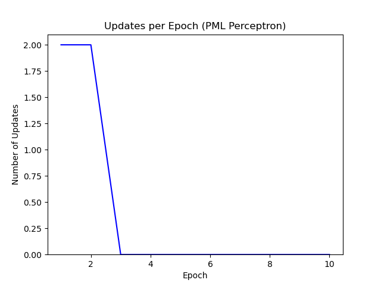
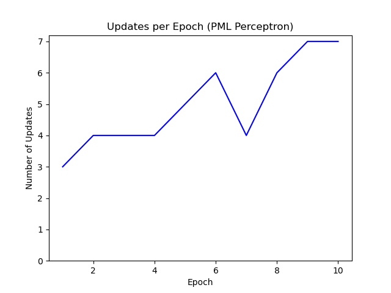

# Perceptrons

### Create synthetic dataset

Use the `create_linearly_sep_dataset.py` script to create 
a synthetic dataset. By default, a linearly separated dataset 
containing two groups will be output to a `dataset.txt` file.
Values of the two groups consist of integers between 1 and 100.
For linearly separated datasets, a random threshold is created
and the values (x1) for the first group will be 1 <= x1 < threshold.
The values (x2) for the second group wil be threshold <= x2 <= 100.
For non-linearly separated datasets, the values of both groups will 
be an integer between 1 and 100 inclusively. To ensure that the two 
groups are non-linearly separated, at least one of the random integers 
is inserted into both groups. The group assignments and values are
output to a tab-delimited file. A plot of the first two dimensions
is saved if the number of dimensions is greater than one.

Parameters:

- `-s` or `--size`: set sample size of dataset'

- `-o` or `--output`: set output file name

- `-l` or `--linearly_sep`: boolean to describe if dataset is 
linearly separable.

- `-f` or `--features`: set number of features

Example creating a two dimensional linearly separable dataset:
```
python create_linearly_sep_dataset.py -s 10 -o linear_sep_dataset.txt -f 2
```

Plot linearly separable dataset:


Example creating a two dimensional non-linearly separable dataset:
```
python create_linearly_sep_dataset.py -s 10 -o non_linear_sep_dataset.txt -f 2 -l F
```

Plot non-linearly separable dataset:


### Implement Perceptron

A perceptron was implemented in `perceptrons.py`. Weights are originally set as 
random values between 0 and 1. To predict values, the dot product of weights and 
values are calculated then rounded to the nearest class (0 if less than 0.5, else 1). 
The fit function updates the weights over a set number of iterations. The weights 
are updated using the perceptron learning rule: 
`dw = learning rate * (actual - predicted) * xi`. Additionally, a plot_results 
function was implemented to plot the number of errors at each epoch. 

```
class Perceptron:
    """Perceptron implementation"""

    def __init__(self, rate=0.01, n=50, random_state=1, reduction=None):
        self.rate = rate  # learning rate
        self.n = n  # number of iterations
        self.random_state = random_state  #set random state
        self.reduction = reduction  # optional if dynamic learning rate is desired

    def fit(self, X, y):
        """Fit training data"""
        rand = np.random.RandomState(self.random_state)
        # initialize random weights
        self.w = rand.uniform(low=0.0, high=1, size=1+X.shape[1])
        # initialize array to hold # errors at each epoch
        self.err = []
        # loop through epochs
        for i in range(self.n):
            # initialize variable to keep track of errors
            errors = 0
            # if a rate reduction function is given
            if self.reduction is not None:
                # get updated rate
                self.rate = self.reduction.get()
            # loop through features and targets in X and y
            for xi, y_true in zip(X, y):
                # calulate update using perceptron learning rule
                u = self.rate * (y_true - self.predict(xi))
                # update weights
                self.w[1:] += (u * xi)
                self.w[0] += u
                # add to errors if update is not 0
                errors += int(u != 0.0)
            # append total number of errors in epoch to err
            self.err.append(errors)
        return self

    def calculate_dot(self, X):
        """Calculates dot product of values and weights wTx"""
        return np.dot(X, self.w[1:]) + self.w[0]

    def predict(self, X):
        """Predict results based on the output of the dot product"""
        # return 1 if dot product is greater or equal to 0.5, else 0
        return np.where(self.calculate_dot(X) >= 0.5, 1, 0)

    def plot_results(self):
        """Returns a plot of error vs epoch"""
        # close any open plt
        plt.close()
        # plot epoch as x and num errors as y
        plt.plot([i + 1 for i in range(len(self.err))], self.err, 'b')
        plt.xlabel("Epoch")
        plt.ylabel("Number of Updates")
        plt.ylim(bottom=0)
        return plt
```

Additionally, the perceptron in Python Machine Learning (PML) Ch. 2 
was tested. The textbook implementation was modified slightly. The 
textbook implementation used data with -1 or 1 classes, so the 
rounding in the predict class was changed for 0 or 1 
classes. A plot_results function was added to facilitate data reporting.
One difference between the implementation above and the textbook
implementation is that the implementation above sets the initial
weights to random values, where the random numbers are taken from 
a normal distribution with a standard deviation of 0.01. 

```
class PerceptronPML(object):
    """Perceptron classifier.

    Parameters
    ------------
    eta : float
      Learning rate (between 0.0 and 1.0)
    n_iter : int
      Passes over the training dataset.
    random_state : int
      Random number generator seed for random weight
      initialization.

    Attributes
    -----------
    w_ : 1d-array
      Weights after fitting.
    errors_ : list
      Number of misclassifications (updates) in each epoch.

    """

    def __init__(self, eta=0.01, n_iter=50, random_state=1):
        self.eta = eta
        self.n_iter = n_iter
        self.random_state = random_state

    def fit(self, X, y):
        """Fit training data.

        Parameters
        ----------
        X : {array-like}, shape = [n_samples, n_features]
          Training vectors, where n_samples is the number of
          samples and
          n_features is the number of features.
        y : array-like, shape = [n_samples]
          Target values.

        Returns
        -------
        self : object

        """
        rgen = np.random.RandomState(self.random_state)
        self.w_ = rgen.normal(loc=0.0, scale=0.01,
                              size=1 + X.shape[1])
        self.errors_ = []

        for _ in range(self.n_iter):
            errors = 0
            for xi, target in zip(X, y):
                update = self.eta * (target - self.predict(xi))
                self.w_[1:] += update * xi
                self.w_[0] += update
                errors += int(update != 0.0)
            self.errors_.append(errors)
        return self

    def net_input(self, X):
        """Calculate net input"""
        return np.dot(X, self.w_[1:]) + self.w_[0]

    def predict(self, X):
        """Return class label after unit step"""
        return np.where(self.net_input(X) >= 0.5, 1, 0)  # changed for classes 1 and 0

    def plot_results(self):
        """Returns a plot of error vs epoch"""
        plt.close()
        plt.plot([i + 1 for i in range(len(self.errors_))], self.errors_, 'b')
        plt.xlabel("Epoch")
        plt.ylabel("Number of Updates")
        plt.ylim(bottom=0)
        return plt
```

To visualize the decision boundaries, a function was added to plot
the data with the model's decision boundary. This function is from 
PML Chapter 2.

```
def plot_decision_regions(X, y, classifier, resolution=0.02):
    """Function from Ch.2 of Python Machine Learning ISBN: 9781787125933"""
    # setup marker generator and color map
    markers = ('s', 'x', 'o', '^', 'v')
    colors = ('red', 'blue', 'lightgreen', 'gray', 'cyan')
    cmap = ListedColormap(colors[:len(np.unique(y))])

    # plot the decision surface
    x1_min, x1_max = X[:, 0].min() - 1, X[:, 0].max() + 1
    x2_min, x2_max = X[:, 1].min() - 1, X[:, 1].max() + 1
    xx1, xx2 = np.meshgrid(np.arange(x1_min, x1_max, resolution),
                           np.arange(x2_min, x2_max, resolution))
    Z = classifier.predict(np.array([xx1.ravel(), xx2.ravel()]).T)
    Z = Z.reshape(xx1.shape)
    plt.contourf(xx1, xx2, Z, alpha=0.3, cmap=cmap)
    plt.xlim(xx1.min(), xx1.max())
    plt.ylim(xx2.min(), xx2.max())

    # plot class samples
    for idx, cl in enumerate(np.unique(y)):
        plt.scatter(x=X[y == cl, 0],
                    y=X[y == cl, 1],
                    alpha=0.8,
                    c=colors[idx],
                    marker=markers[idx],
                    label=cl,
                    edgecolor='black')
``` 

### Test perceptron on synthetic datasets

To test the implemented perceptrons, additional code was added
to the `perceptrons.py` script to run both models on a given 
dataset. The script will train and fit the data using each 
implementation and save a plot of updates vs epochs and the decision
boundary for each one.

```
# read data using pandas
train_data = pd.read_csv(train_file, sep='\t')

# set target
y = train_data.group

# subset data for features
X = train_data.iloc[:, [1, 2]].values

# split data
X_train, X_val, y_train, y_val = train_test_split(X, y, random_state=1)

# set and train model (using learning rate 0.0001)
model = Perceptron(rate=0.0001, n=125)
model.fit(X_train, y_train)
plt1 = model.plot_results()
plt1.title('Updates per Epoch (Perceptron)')
plt1.savefig(str(output_file) + '_updates_per_epoch_perceptron' + '.png')

# plot decision boundary
plt.close()
plot_decision_regions(X_train, y_train, classifier=model)
plt.xlabel("value_1")
plt.ylabel("value_2")
plt.legend(loc='upper left')
plt.title("Decision Boundary (Perceptron)")
plt.savefig(str(output_file) + '_boundary_perceptron' + '.png')

# set and train model using PML implementation
model2 = PerceptronPML(eta=0.0001, n_iter=10)
model2.fit(X_train, y_train)
# plot errors vs epoch for PML implementation
plt2 = model2.plot_results()
plt2.title('Updates per Epoch (PML Perceptron)')
plt2.savefig(str(output_file) + '_updates_per_epoch_pml_perceptron' + '.png')

# plot decision boundary
plt.close()
plot_decision_regions(X_train, y_train, classifier=model2)
plt.xlabel("value_1")
plt.ylabel("value_2")
plt.legend(loc='upper left')
plt.title("Decision Boundary (PML Perceptron)")
plt.savefig(str(output_file) + '_boundary_pml_perceptron' + '.png')
```

The `perceptrons.py` script was run on both the linearly and non-linearly
separable datasets generated above. 

```
python perceptrons.py -t linear_sep_dataset.txt -o synthetic_results\linear_sep_data
python perceptrons.py -t non_linear_sep_dataset.txt -o synthetic_results\non_linear_sep_data
```

For the linearly separable dataset, both models converged (no more updates). 
The PML implementation converged one epoch earlier as seen in the following plots. 




The determined decision boundaries are shown in the following plots:


Both models were not able to converge using the non-linearly separable dataset. 




The models did not determine correct decision boundaries for the non-linearly separable
datasets as shown in the following plots:


# Usage

### Create synthetic dataset

Use the `create_linearly_sep_dataset.py` script to create 
a synthetic dataset. 

Parameters:

- `-s` or `--size`: set sample size of dataset'

- `-o` or `--output`: set output file name

- `-l` or `--linearly_sep`: boolean to describe if dataset is 
linearly separable.

- `-f` or `--features`: set number of features

Example creating a two dimensional linearly separable dataset:

```
python create_linearly_sep_dataset.py -s 10 -o linear_sep_dataset.txt -f 2
```

Example creating a two dimensional non-linearly separable dataset:

```
python create_linearly_sep_dataset.py -s 10 -o non_linear_sep_dataset.txt -f 2 -l F
```

### Test Perceptron Implementation

Use `perceptrons.py` to run two implementations of a perceptron on a given
dataset.

Parameters:

- `-t` or `--train`: input training dataset

- `-o` or `--output`: set output file base name

Example:

```
python perceptrons.py -t linear_sep_dataset.txt -o synthetic_results\linear_sep_data
```